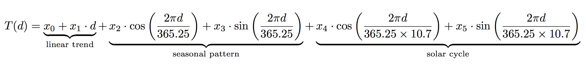
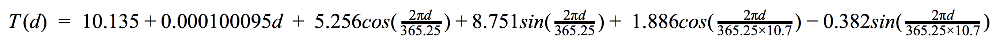

# assignment3
- Rhea Mae Edwards **(edwardrh)**, Miles Curry **(currymi)** & Rutger Farry **(farryr)**
- CS 325
- Dr. Xiaoli Fern
- 15 March 2016

## Warm-up question: Least squares isn't good enough for me
**Write summary here**
The goal of this question was to determine the line of best fit using linear
program. Given the set of points, `(x1, y1), (x2,y2), ... (xN, yN)`. find values of `a` and `b` to minimize: .

### Linear program description
**TODO**
To turn this into a linear program, the variable `m` was created to represent as
the objective function to be  *minimized*. With values: `(1,3), (2,5), (3,7),
(5,11), (7,14), (8,15), (10, 19)`.

    * Objective: `Min m`
    
    Such that:

    * `a * x + b - y <= m`
    * `-a * x - b + y <= m'
    * For all points `(x1, y1), (x2, y2), ... (xN, yN)`.

### Running the code
**TODO**
The script was built in Python 2 and uses [PuLP] as its linear program solver as
well as numpy Before running the script, PuLP will need to be installed.

```bash
pip install -y requirements.txt     # Install PuLP
python warm_up.py                   # Run the Script
```
### Solution
**TODO**
The best values of `a` and `b`, given the set of points: `(1,3), (2,5), (3,7),
(5,11), (7,14), (8,15), (10, 19)` found by the script is:

    * `a: 1.7142857`
    * `b: 1.8571492`

And the output of PuLP confirmed it was an optimal solution:

```bash
Status: Optimal
a: 1.7142857
b: 1.8571492
```
### Plot
**TODO**


## Warming-up question: Local temperature change
This was a fun problem to solve and one of the first times my computer was stressed for a legitimate reason. The program took a little under a minute to run. We found that the average temperature rise in Corvallis is about **0.66°F** per decade, which is pretty far ahead of the US average of **0.29 to 0.46°F**.

### Running the code
The script is written in Python 2, so running it should be simple on most computers. Make sure to pass in the path to a csv file containing weather data like so:
```bash
python forecast.py {weather_data_csv}
```

### Linear program description
This linear program was first presented by Robert Vanderbei in his paper [Local Warming](http://www.princeton.edu/~rvdb/tex/LocalWarming/LocalWarming.pdf). We solve for 6 unknown regression coefficients, `x0...x5` and fill them into the following equation:



The model is split into three parts, with a *linear trend* indicating overall rise in temperature over time, a *seasonal pattern* representing the temperature based on day of the year and a *solar cycle* representing the change in temperature based on Earth's position relative to the sun. 

`T(d)` will be the predicted temperature for that day after the regression coefficients are calculated. In this case, `d` should equal the number of days since May 1, 1952 (first day in NOAA data), for example, for today, March 15, 2017, we'd plug in `d = 23695`.

### Solution
The raw output of our program, using Corvallis data downloaded from Canvas on March 15, 2017 is as follows:
```bash
$ python forecast.py Corvallis.csv
Status: Optimal
x0: 10.135061
x1: 0.00010095409
x2: 5.2564156
x3: 8.7514693
x4: 1.8864462
x5: -0.38240757
```
This gives us the values of `x0...x5` and the output status from GuLP, showing that the solution was optimal.

Pluggin this into the equatiuon, we get the following equation, which should give us a average temperature estimate for any day after May 1, 1952, in degrees Celsius:



### Plot
**TODO**
- raw data plotted as points in 2-d (with d as the x-axis and T as the y-axis),
- best fit curve, and
- linear part of the curve x0 + x1 · d.

### Reflection
Looking back at the [output of the linear equation solver](#solution), the most interesting variable is probably `x1`, which is the slope of the linear trend of temperature change in Corvallis, OR. This shows that, on average, the temperature has been rising by 0.00010095409°C per day since May 1, 1952. This translates to a rise of roughly 0.369°C, or 0.6642°F per decade. This is a little higher than the EPA's calculations of rise in US temperatures of 0.29 to 0.46°F per decade since 1979, but is not unreasonable.

## Meta
If you're reading the PDF version of this file, we generated it from `README.md` using pandoc. You can update it from the README file using:
```bash
pandoc README.md --latex-engine=xelatex -o writeup.pdf
